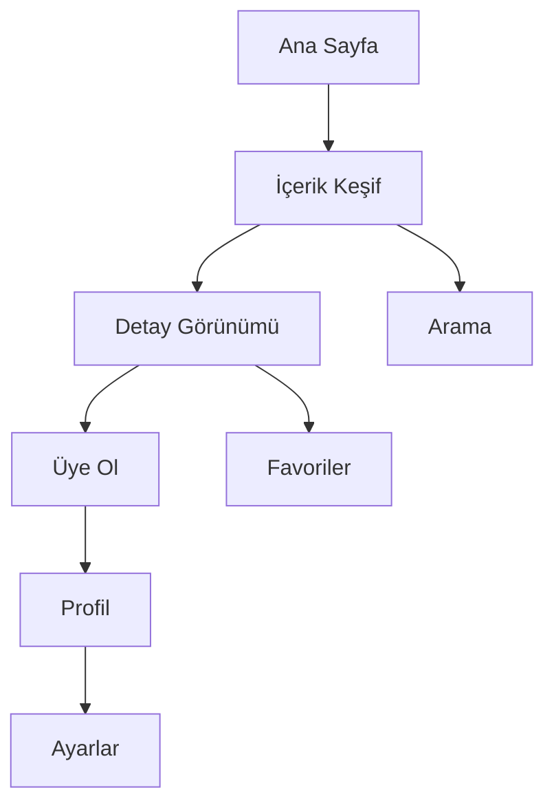

## 1. Ürün Genel Bakış
Intentional Minimalism tasarım felsefesiyle oluşturulmuş, amaca yönelik ve dikkat dağıtmayan dijital deneyim platformu. Kullanıcıyı yorucu detaylardan arındırarak, yalnızca gerekli olanla etkileşim kurmasını sağlar.

- Problem: Gereksiz UI elemanları ve dikkat dağıtan tasarım unsurları
- Çözüm: Her pikselin amacı hesaplanmış, asimetrik ve özgün düzenler
- Hedef: Yüksek kaliteli, anti-jenerik dijital ürünler arayan geliştiriciler ve tasarımcılar

## 2. Temel Özellikler

### 2.1 Kullanıcı Rolleri
| Rol | Kayıt Yöntemi | Temel İzinler |
|------|---------------------|------------------|
| Ziyaretçi | Kayıt gerekmez | Temel içerik görüntüleme |
| Üye | Email ile kayıt | Kişiselleştirme, favoriler |
| Premium Üye | Davetiye ile yükseltme | Gelişmiş özellikler, öncelikli destek |

### 2.2 Özellik Modülü
Intentional Minimalism platformu şu temel sayfalardan oluşur:

1. **Ana Sayfa**: Asimetrik ızgara düzeni, animasyonlu giriş bölümü, dikkat çekmeyen navigasyon
2. **İçerik Keşif**: Beyaz boşluk odaklı liste görünümü, mikro etkileşimler
3. **Detay Görünümü**: Odaklanmış içerik sunumu, bağlamsal aksiyonlar
4. **Kullanıcı Profili**: Minimal form düzenleri, kişiselleştirme ayarları

### 2.3 Sayfa Detayları
| Sayfa Adı | Modül Adı | Özellik Açıklaması |
|-----------|-------------|---------------------|
| Ana Sayfa | Giriş Bölümü | Asimetrik yerleşimde otomatik animasyon geçişleri, dikkat dağıtmayan tipografi hiyerarşisi |
| Ana Sayfa | Navigasyon | Görünürde olmayan ancak erişilebilir menü, hover animasyonları |
| Ana Sayfa | İçerik Önizleme | Beyaz boşluk stratejisiyle düzenlenmiş kartlar, yavaş yükleme animasyonları |
| Keşif | Liste Görünümü | Sonsuz kaydırma, minimal filtreleme çubuğu, odak modu |
| Keşif | Arama | Gerçek zamanlı arama, otomatik tamamlama önerileri |
| Detay | İçerik Gösterimi | Okuma modu, tipografi optimizasyonu, bağlamsal menüler |
| Detay | Etkileşim | Gizli aksiyon düğmeleri, klavye kısayolları |
| Profil | Bilgi Düzenleme | Tek alan odaklı formlar, otomatik kaydetme |
| Profil | Tercihler | Minimal toggle anahtarları, anında geri bildirim |

## 3. Temel Süreçler

### Ziyaretçi Akışı:
Ana Sayfa → İçerik Keşif → Detay Görünümü → Üye Olma

### Üye Akışı:
Giriş → Ana Sayfa → Favorileme → Profil Yönetimi

### Premium Üye Akışı:
Özel İçerik Erişimi → Gelişmiş Araçlar → Kişiselleştirilmiş Deneyim

## 4. Kullanıcı Arayüzü Tasarımı

### 4.1 Tasarım Stili
- **Birincil Renk**: #000000 (Saf siyah), #FFFFFF (Saf beyaz)
- **İkincil Renk**: #F5F5F5 (Açık gri), #1A1A1A (Koyu gri)
- **Vurgu Rengi**: #FF3366 (Canlı pembe) - sadece kritik aksiyonlarda
- **Tipografi**: Inter veya SF Pro Display, 14-18px temel boyutlar
- **Düğme Stili**: Yuvarlak köşeler (8px), minimal gölge, hover animasyonları
- **Boşluk**: 8px grid sistemi, asimetrik padding değerleri
- **İkon Stili**: Outline ikonlar, 2px çizgi kalınlığı, basit geometrik formlar

### 4.2 Sayfa Tasarımı Genel Bakış
| Sayfa Adı | Modül Adı | UI Elemanları |
|-----------|-------------|-------------|
| Ana Sayfa | Giriş Bölümü | Tam ekran hero, 70/30 asimetrik bölünme, yavaş fade-in animasyonları, Inter 700 ağırlığında başlık |
| Ana Sayfa | Navigasyon | Üstte sabit 64px yüksekliğinde, %80 opacity arka plan, backdrop-blur efekti |
| Keşif | Liste | 2 sütun ızgara, kartlar arası 32px boşluk, hover'da 4px translateY animasyonu |
| Detay | İçerik | Maksimum 65 karakter satır uzunluğu, 1.6 satır yüksekliği, 24px paragraf aralığı |
| Profil | Form | Tek sütun düzeni, 16px input yüksekliği, gerçek zamanlı doğrulama ikonları |

### 4.3 Duyarlılık
- **Desktop-First**: 1440px breakpoint'ten başlayarak tasarlanır
- **Tablet Uyumu**: 768px'de 2 sütun → 1 sütun geçişi
- **Mobil Optimizasyonu**: 375px minimum genişlik, dokunma hedefleri minimum 44px
- **Performans**: Lazy loading, görsel optimize etme, minimum CSS animasyonları

### 4.4 Mikro Etkileşimler
- Hover durumlarında 200ms ease-in-out geçişleri
- Tıklama geri bildirimi için 2px scale down animasyonu
- Scroll-triggered animasyonlar için Intersection Observer API
- Form alanlarında focus durumunda 1px border kalınlaşması