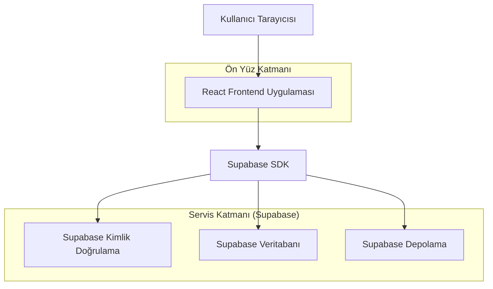
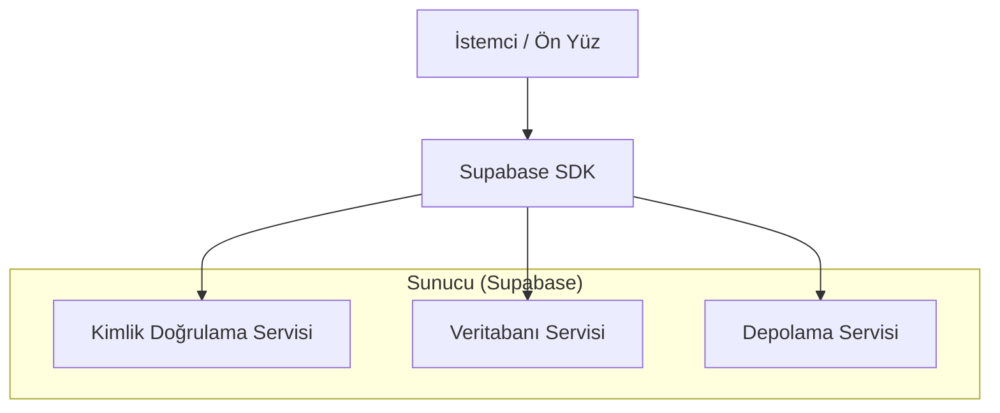
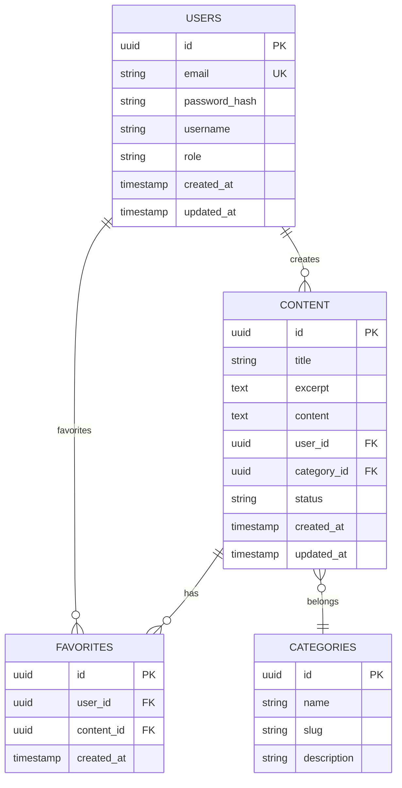

## 1. Mimarisi Tasarımı



## 2. Teknoloji Açıklaması
- **Ön Yüz**: React@18 + TailwindCSS@3 + Vite
- **Başlatma Aracı**: vite-init
- **Backend**: Supabase (BaaS)
- **Veritabanı**: PostgreSQL (Supabase üzerinde)
- **Kimlik Doğrulama**: Supabase Auth
- **Depolama**: Supabase Storage
- **Animasyon Kütüphanesi**: Framer Motion
- **Tip Denetimi**: TypeScript@5

## 3. Rota Tanımları
| Rota | Amaç |
|-------|---------|
| / | Ana sayfa, asimetrik ızgara düzeni ve giriş animasyonları |
| /discover | İçerik keşif sayfası, beyaz boşluk odaklı liste görünümü |
| /content/:id | Detay görünümü, okuma modu ve bağlamsal aksiyonlar |
| /profile | Kullanıcı profili, minimal form düzenleri |
| /settings | Kişiselleştirme ayarları, toggle anahtarları |
| /login | Supabase kimlik doğrulama entegrasyonu |
| /register | Email tabanlı kullanıcı kaydı |

## 4. API Tanımları

### 4.1 Kimlik Doğrulama API'leri

**Kullanıcı Girişi**
```
POST /auth/v1/token
```

İstek:
| Parametre Adı | Parametre Türü | Zorunlu | Açıklama |
|-----------|-------------|-------------|-------------|
| email | string | true | Kullanıcı email adresi |
| password | string | true | Şifre (düz metin) |

Yanıt:
```json
{
  "access_token": "eyJhbGc...",
  "token_type": "bearer",
  "expires_in": 3600,
  "refresh_token": "-4UpCc...",
  "user": {
    "id": "123e4567-e89b-12d3-a456-426614174000",
    "email": "user@example.com"
  }
}
```

**İçerik Listesi**
```
GET /rest/v1/content
```

İstek Parametreleri:
| Parametre Adı | Parametre Türü | Zorunlu | Açıklama |
|-----------|-------------|-------------|-------------|
| limit | number | false | Sayfa başına içerik sayısı (varsayılan: 20) |
| offset | number | false | Atlama değeri (sayfalama için) |
| category | string | false | Kategori filtresi |

Yanıt:
```json
[
  {
    "id": "content-123",
    "title": "Minimalist Tasarım Prensipleri",
    "excerpt": "Her pikselin amacı hesaplanmış tasarım...",
    "category": "design",
    "created_at": "2024-01-15T10:30:00Z"
  }
]
```

## 5. Sunucu Mimarisi Diyagramı



## 6. Veri Modeli

### 6.1 Veri Modeli Tanımı


### 6.2 Veri Tanım Dili

**Kullanıcı Tablosu (users)**
```sql
-- tablo oluşturma
CREATE TABLE users (
    id UUID PRIMARY KEY DEFAULT gen_random_uuid(),
    email VARCHAR(255) UNIQUE NOT NULL,
    password_hash VARCHAR(255) NOT NULL,
    username VARCHAR(50) UNIQUE NOT NULL,
    role VARCHAR(20) DEFAULT 'member' CHECK (role IN ('member', 'premium')),
    created_at TIMESTAMP WITH TIME ZONE DEFAULT NOW(),
    updated_at TIMESTAMP WITH TIME ZONE DEFAULT NOW()
);

-- indeksler
CREATE INDEX idx_users_email ON users(email);
CREATE INDEX idx_users_username ON users(username);

-- RLS politikaları
ALTER TABLE users ENABLE ROW LEVEL SECURITY;

-- anon rolüne temel okuma erişimi
GRANT SELECT ON users TO anon;

-- authenticated rolüne tam erişim
GRANT ALL PRIVILEGES ON users TO authenticated;
```

**İçerik Tablosu (content)**
```sql
-- tablo oluşturma
CREATE TABLE content (
    id UUID PRIMARY KEY DEFAULT gen_random_uuid(),
    title VARCHAR(255) NOT NULL,
    excerpt TEXT NOT NULL,
    content TEXT NOT NULL,
    user_id UUID REFERENCES users(id),
    category_id UUID REFERENCES categories(id),
    status VARCHAR(20) DEFAULT 'published' CHECK (status IN ('draft', 'published', 'archived')),
    view_count INTEGER DEFAULT 0,
    created_at TIMESTAMP WITH TIME ZONE DEFAULT NOW(),
    updated_at TIMESTAMP WITH TIME ZONE DEFAULT NOW()
);

-- indeksler
CREATE INDEX idx_content_user_id ON content(user_id);
CREATE INDEX idx_content_category_id ON content(category_id);
CREATE INDEX idx_content_status ON content(status);
CREATE INDEX idx_content_created_at ON content(created_at DESC);

-- RLS politikaları
ALTER TABLE content ENABLE ROW LEVEL SECURITY;

-- anon rolüne okuma erişimi (yalnızca yayınlanmış içerik)
CREATE POLICY "anon_read_published" ON content
    FOR SELECT
    TO anon
    USING (status = 'published');

-- authenticated rolüne tam erişim
GRANT ALL PRIVILEGES ON content TO authenticated;
```

**Kategoriler Tablosu (categories)**
```sql
-- tablo oluşturma
CREATE TABLE categories (
    id UUID PRIMARY KEY DEFAULT gen_random_uuid(),
    name VARCHAR(100) NOT NULL,
    slug VARCHAR(100) UNIQUE NOT NULL,
    description TEXT,
    created_at TIMESTAMP WITH TIME ZONE DEFAULT NOW()
);

-- başlangıç verileri
INSERT INTO categories (name, slug, description) VALUES
    ('Tasarım', 'design', 'Minimalist tasarım prensipleri'),
    ('Teknoloji', 'technology', 'Basitlik odaklı teknoloji'),
    ('Yaşam', 'lifestyle', 'Amaca yönelik yaşam tarzı');
```

**Favoriler Tablosu (favorites)**
```sql
-- tablo oluşturma
CREATE TABLE favorites (
    id UUID PRIMARY KEY DEFAULT gen_random_uuid(),
    user_id UUID REFERENCES users(id) ON DELETE CASCADE,
    content_id UUID REFERENCES content(id) ON DELETE CASCADE,
    created_at TIMESTAMP WITH TIME ZONE DEFAULT NOW(),
    UNIQUE(user_id, content_id)
);

-- RLS politikaları
ALTER TABLE favorites ENABLE ROW LEVEL SECURITY;

-- kullanıcılar yalnızca kendi favorilerini yönetebilir
CREATE POLICY "users_manage_own_favorites" ON favorites
    FOR ALL
    TO authenticated
    USING (auth.uid() = user_id)
    WITH CHECK (auth.uid() = user_id);
```