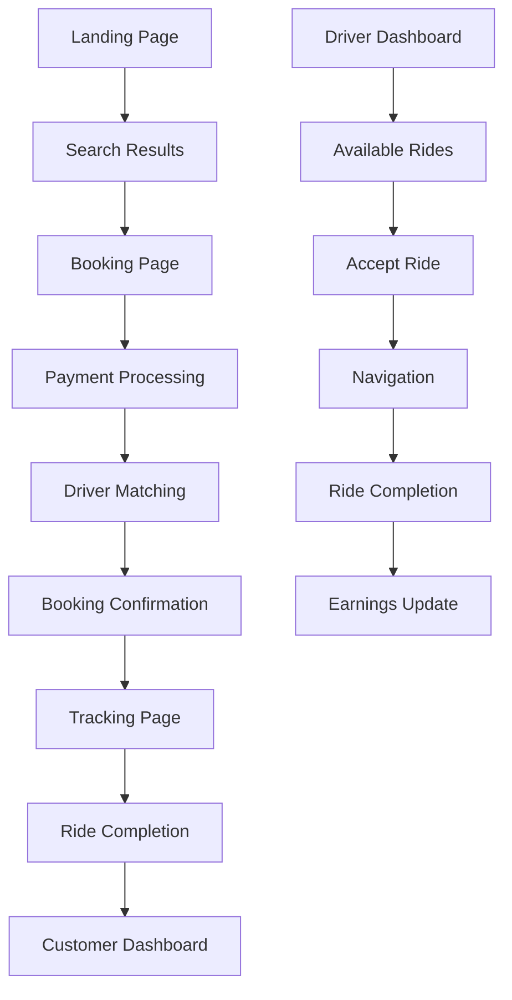

## 1. Product Overview
Transfer booking web application that connects customers with professional drivers for airport transfers, city-to-city transportation, and hourly car rentals. The platform solves the problem of reliable, pre-booked transportation with transparent pricing and real-time tracking.

Target users include travelers needing airport transfers, business professionals requiring reliable transportation, and local residents needing occasional driver services. The product provides value through verified drivers, fixed pricing, and real-time tracking capabilities.

## 2. Core Features

### 2.1 User Roles
| Role | Registration Method | Core Permissions |
|------|---------------------|------------------|
| Customer | Email/Social registration | Browse drivers, book rides, track drivers, make payments, rate drivers |
| Driver | Email registration + document verification | Accept bookings, update location, manage availability, view earnings, upload documents |

### 2.2 Feature Module
The transfer booking application consists of the following main pages:
1. **Landing page**: Hero section with booking form, featured routes, language selector
2. **Search results page**: Available drivers, pricing comparison, driver profiles
3. **Booking page**: Trip details, passenger info, payment method selection
4. **Tracking page**: Real-time map, driver location, estimated arrival time
5. **Customer dashboard**: Active bookings, history, profile settings, payment methods
6. **Driver dashboard**: Available rides, accepted rides, earnings, availability toggle
7. **Driver documents page**: License upload, vehicle documents, verification status
8. **Admin dashboard**: User management, booking oversight, driver verification

### 2.3 Page Details
| Page Name | Module Name | Feature description |
|-----------|-------------|---------------------|
| Landing page | Hero booking form | Select pickup/dropoff locations, date/time, passenger count, vehicle type. Auto-detect user location. |
| Landing page | Featured routes | Display popular airport transfer routes with fixed pricing. Quick booking buttons. |
| Landing page | Language selector | Dropdown with 5+ languages, persists user preference. |
| Search results | Driver listings | Show available drivers with photos, ratings, vehicle details, pricing. Filter by price, rating, vehicle type. |
| Search results | Map view | Interactive map showing driver locations relative to pickup point. |
| Booking page | Trip summary | Display route, distance, estimated time, base price. Allow promo code application. |
| Booking page | Passenger details | Collect passenger name, phone, email, flight number (for airport pickups). |
| Booking page | Payment selection | Credit card, PayPal, cash options. Save card for future use. |
| Tracking page | Live map | Real-time driver location with GPS tracking, estimated arrival time updates. |
| Tracking page | Driver info | Display driver photo, name, vehicle details, phone number for contact. |
| Customer dashboard | Active bookings | List current/upcoming rides with status, quick access to tracking. |
| Customer dashboard | Booking history | Past rides with receipts, ability to rebook same route. |
| Customer dashboard | Profile settings | Update personal info, add payment methods, notification preferences. |
| Driver dashboard | Available rides | Real-time list of nearby ride requests with pickup location and price. |
| Driver dashboard | Accepted rides | Current ride details with navigation, customer contact, completion button. |
| Driver dashboard | Earnings summary | Daily/weekly/monthly earnings breakdown, withdrawal options. |
| Driver documents | License upload | Upload driver's license, vehicle registration, insurance documents. |
| Driver documents | Verification status | Display document approval status, request re-verification if needed. |
| Admin dashboard | User management | View all users, suspend/activate accounts, manual verification. |
| Admin dashboard | Booking oversight | Monitor all bookings, intervene in disputes, issue refunds. |

## 3. Core Process
**Customer Flow:**
1. Customer lands on homepage and enters pickup/dropoff locations
2. System shows available drivers with pricing and estimated times
3. Customer selects preferred driver and proceeds to booking
4. Customer enters passenger details and selects payment method
5. Booking request is sent to selected driver(s)
6. Upon driver acceptance, customer receives confirmation with tracking link
7. Customer can track driver location in real-time until pickup
8. After ride completion, customer can rate driver and receive receipt

**Driver Flow:**
1. Driver registers and uploads required documents for verification
2. Once approved, driver sets availability status to "online"
3. Driver receives booking requests based on proximity and availability
4. Driver reviews request details and accepts/declines within 30 seconds
5. Upon acceptance, driver receives customer details and navigation to pickup
6. Driver updates ride status: "en route", "arrived", "in progress", "completed"
7. Driver earnings are updated automatically after ride completion

## 4. User Interface Design

### 4.1 Design Style
- **Primary colors**: Deep blue (#1E3A8A) for trust and reliability, accent orange (#F97316) for CTAs
- **Secondary colors**: Light gray (#F3F4F6) backgrounds, white cards with subtle shadows
- **Button style**: Rounded corners (8px radius), prominent CTAs in orange, secondary in outline style
- **Font**: Inter for headings, Roboto for body text, 16px base size with clear hierarchy
- **Layout**: Card-based design with generous white space, mobile-first responsive approach
- **Icons**: Material Design icons for consistency, emoji for user ratings and status indicators

### 4.2 Page Design Overview
| Page Name | Module Name | UI Elements |
|-----------|-------------|-------------|
| Landing page | Hero booking form | Large input fields with location autocomplete, prominent "Get Transfer" button, background image of luxury vehicle |
| Search results | Driver cards | Horizontal cards with driver photo left, rating stars, vehicle image, price tag in orange, "Book Now" button |
| Tracking page | Live map | Full-screen map with driver location pin, bottom sheet with driver details and ETA, refresh indicator |
| Customer dashboard | Booking list | Timeline-style cards with status badges (confirmed, completed, cancelled), action buttons for tracking/rebooking |
| Driver dashboard | Ride requests | Swipeable cards with pickup/dropoff addresses, estimated earnings, accept/decline buttons with 30s countdown |

### 4.3 Responsiveness
- Mobile-first design with breakpoints at 640px, 768px, 1024px, and 1280px
- Touch-optimized buttons with minimum 44px tap targets
- Swipe gestures for driver ride acceptance on mobile
- Collapsible navigation menu for mobile screens
- Map view adapts between full-screen (mobile) and split-screen (desktop) layouts