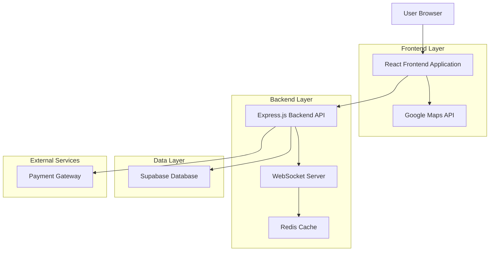
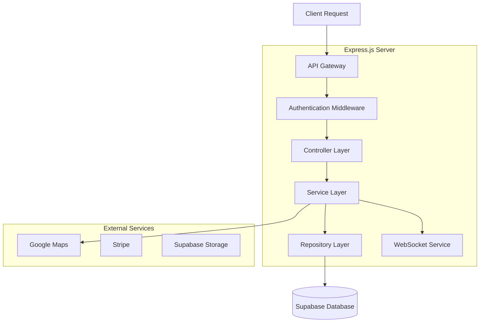
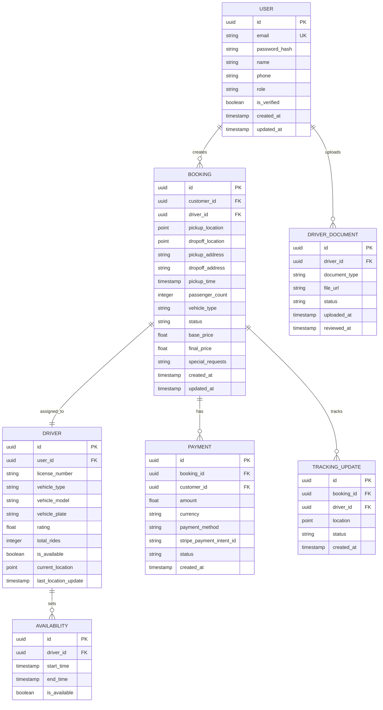

## 1. Architecture design



## 2. Technology Description

* **Frontend**: React\@18 + TypeScript + Tailwind CSS\@3 + Vite + Zustand\@4

* **Backend**: Express.js\@4 + TypeScript + Socket.io\@4

* **Database**: Supabase (PostgreSQL) + Prisma\@5 ORM

* **Maps**: Google Maps JavaScript API + Directions API

* **Payments**: Stripe API

* **File Storage**: Supabase Storage

* **Real-time**: Socket.io for bidirectional communication

* **Authentication**: JWT tokens with Supabase Auth

## 3. Route definitions

| Route                | Purpose                                     |
| -------------------- | ------------------------------------------- |
| /                    | Landing page with booking form              |
| /search              | Search results for available drivers        |
| /booking/:id         | Booking details and confirmation            |
| /tracking/:bookingId | Real-time ride tracking                     |
| /customer/dashboard  | Customer dashboard with bookings            |
| /driver/dashboard    | Driver dashboard for managing rides         |
| /driver/documents    | Driver document upload and verification     |
| /admin/dashboard     | Admin panel for user and booking management |
| /login               | User authentication                         |
| /register            | User registration                           |
| /profile             | User profile management                     |

## 4. API definitions

### 4.1 Authentication APIs

**Customer Registration**

```
POST /api/auth/register/customer
```

Request:

| Param Name | Param Type | isRequired | Description                    |
| ---------- | ---------- | ---------- | ------------------------------ |
| email      | string     | true       | Customer email address         |
| password   | string     | true       | Password (min 8 characters)    |
| name       | string     | true       | Full name                      |
| phone      | string     | true       | Phone number with country code |

Response:

```json
{
  "success": true,
  "data": {
    "userId": "uuid",
    "token": "jwt_token",
    "refreshToken": "refresh_token"
  }
}
```

**Driver Registration**

```
POST /api/auth/register/driver
```

Request:

| Param Name    | Param Type | isRequired | Description                        |
| ------------- | ---------- | ---------- | ---------------------------------- |
| email         | string     | true       | Driver email address               |
| password      | string     | true       | Password (min 8 characters)        |
| name          | string     | true       | Full name                          |
| phone         | string     | true       | Phone number                       |
| licenseNumber | string     | true       | Driver's license number            |
| vehicleType   | string     | true       | Vehicle category (sedan, suv, van) |

**Login**

```
POST /api/auth/login
```

### 4.2 Booking APIs

**Create Booking**

```
POST /api/bookings/create
```

Request:

| Param Name      | Param Type | isRequired | Description                |
| --------------- | ---------- | ---------- | -------------------------- |
| pickupLocation  | object     | true       | {lat, lng, address}        |
| dropoffLocation | object     | true       | {lat, lng, address}        |
| pickupTime      | datetime   | true       | ISO 8601 format            |
| passengerCount  | integer    | true       | Number of passengers (1-8) |
| vehicleType     | string     | true       | sedan, suv, van, luxury    |
| specialRequests | string     | false      | Additional requirements    |

**Accept Booking (Driver)**

```
POST /api/bookings/:bookingId/accept
```

**Update Booking Status**

```
PUT /api/bookings/:bookingId/status
```

Status options: accepted, driver\_en\_route, driver\_arrived, in\_progress, completed, cancelled

### 4.3 Driver APIs

**Get Available Bookings**

```
GET /api/drivers/available-bookings?lat=&lng=&radius=
```

**Update Driver Location**

```
POST /api/drivers/location
```

Request:

| Param Name | Param Type | isRequired | Description            |
| ---------- | ---------- | ---------- | ---------------------- |
| lat        | number     | true       | Current latitude       |
| lng        | number     | true       | Current longitude      |
| accuracy   | number     | false      | GPS accuracy in meters |

**Update Availability**

```
PUT /api/drivers/availability
```

### 4.4 Payment APIs

**Process Payment**

```
POST /api/payments/process
```

Request:

| Param Name        | Param Type | isRequired | Description              |
| ----------------- | ---------- | ---------- | ------------------------ |
| bookingId         | string     | true       | Booking ID               |
| amount            | number     | true       | Payment amount           |
| paymentMethodId   | string     | true       | Stripe payment method ID |
| savePaymentMethod | boolean    | false      | Save for future use      |

## 5. Server architecture diagram



## 6. Data model

### 6.1 Data model definition



### 6.2 Data Definition Language

**Users Table**

```sql
-- create table
CREATE TABLE users (
    id UUID PRIMARY KEY DEFAULT gen_random_uuid(),
    email VARCHAR(255) UNIQUE NOT NULL,
    password_hash VARCHAR(255) NOT NULL,
    name VARCHAR(100) NOT NULL,
    phone VARCHAR(20) NOT NULL,
    role VARCHAR(20) NOT NULL CHECK (role IN ('customer', 'driver', 'admin')),
    is_verified BOOLEAN DEFAULT false,
    created_at TIMESTAMP WITH TIME ZONE DEFAULT NOW(),
    updated_at TIMESTAMP WITH TIME ZONE DEFAULT NOW()
);

-- create index
CREATE INDEX idx_users_email ON users(email);
CREATE INDEX idx_users_role ON users(role);

-- grant permissions
GRANT SELECT ON users TO anon;
GRANT ALL PRIVILEGES ON users TO authenticated;
```

**Drivers Table**

```sql
-- create table
CREATE TABLE drivers (
    id UUID PRIMARY KEY DEFAULT gen_random_uuid(),
    user_id UUID REFERENCES users(id) ON DELETE CASCADE,
    license_number VARCHAR(50) UNIQUE NOT NULL,
    vehicle_type VARCHAR(20) NOT NULL CHECK (vehicle_type IN ('sedan', 'suv', 'van', 'luxury')),
    vehicle_model VARCHAR(100) NOT NULL,
    vehicle_plate VARCHAR(20) UNIQUE NOT NULL,
    rating FLOAT DEFAULT 0.0 CHECK (rating >= 0 AND rating <= 5),
    total_rides INTEGER DEFAULT 0,
    is_available BOOLEAN DEFAULT false,
    current_location POINT,
    last_location_update TIMESTAMP WITH TIME ZONE,
    created_at TIMESTAMP WITH TIME ZONE DEFAULT NOW(),
    updated_at TIMESTAMP WITH TIME ZONE DEFAULT NOW()
);

-- create index
CREATE INDEX idx_drivers_user_id ON drivers(user_id);
CREATE INDEX idx_drivers_available ON drivers(is_available);
CREATE INDEX idx_drivers_location ON drivers USING GIST(current_location);

-- grant permissions
GRANT SELECT ON drivers TO anon;
GRANT ALL PRIVILEGES ON drivers TO authenticated;
```

**Bookings Table**

```sql
-- create table
CREATE TABLE bookings (
    id UUID PRIMARY KEY DEFAULT gen_random_uuid(),
    customer_id UUID REFERENCES users(id),
    driver_id UUID REFERENCES drivers(id),
    pickup_location POINT NOT NULL,
    dropoff_location POINT NOT NULL,
    pickup_address VARCHAR(255) NOT NULL,
    dropoff_address VARCHAR(255) NOT NULL,
    pickup_time TIMESTAMP WITH TIME ZONE NOT NULL,
    passenger_count INTEGER NOT NULL CHECK (passenger_count > 0 AND passenger_count <= 8),
    vehicle_type VARCHAR(20) NOT NULL CHECK (vehicle_type IN ('sedan', 'suv', 'van', 'luxury')),
    status VARCHAR(20) NOT NULL CHECK (status IN ('pending', 'accepted', 'driver_en_route', 'driver_arrived', 'in_progress', 'completed', 'cancelled')),
    base_price DECIMAL(10,2) NOT NULL,
    final_price DECIMAL(10,2),
    special_requests TEXT,
    created_at TIMESTAMP WITH TIME ZONE DEFAULT NOW(),
    updated_at TIMESTAMP WITH TIME ZONE DEFAULT NOW()
);

-- create index
CREATE INDEX idx_bookings_customer_id ON bookings(customer_id);
CREATE INDEX idx_bookings_driver_id ON bookings(driver_id);
CREATE INDEX idx_bookings_status ON bookings(status);
CREATE INDEX idx_bookings_pickup_time ON bookings(pickup_time);
CREATE INDEX idx_bookings_location ON bookings USING GIST(pickup_location);

-- grant permissions
GRANT SELECT ON bookings TO anon;
GRANT ALL PRIVILEGES ON bookings TO authenticated;
```

**Payments Table**

```sql
-- create table
CREATE TABLE payments (
    id UUID PRIMARY KEY DEFAULT gen_random_uuid(),
    booking_id UUID REFERENCES bookings(id),
    customer_id UUID REFERENCES users(id),
    amount DECIMAL(10,2) NOT NULL,
    currency VARCHAR(3) DEFAULT 'USD',
    payment_method VARCHAR(50) NOT NULL,
    stripe_payment_intent_id VARCHAR(255),
    status VARCHAR(20) NOT NULL CHECK (status IN ('pending', 'completed', 'failed', 'refunded')),
    created_at TIMESTAMP WITH TIME ZONE DEFAULT NOW()
);

-- create index
CREATE INDEX idx_payments_booking_id ON payments(booking_id);
CREATE INDEX idx_payments_customer_id ON payments(customer_id);
CREATE INDEX idx_payments_status ON payments(status);

-- grant permissions
GRANT SELECT ON payments TO anon;
GRANT ALL PRIVILEGES ON payments TO authenticated;
```

**Driver Documents Table**

```sql
-- create table
CREATE TABLE driver_documents (
    id UUID PRIMARY KEY DEFAULT gen_random_uuid(),
    driver_id UUID REFERENCES drivers(id) ON DELETE CASCADE,
    document_type VARCHAR(50) NOT NULL CHECK (document_type IN ('license', 'vehicle_registration', 'insurance', 'profile_photo')),
    file_url VARCHAR(500) NOT NULL,
    status VARCHAR(20) NOT NULL CHECK (status IN ('pending', 'approved', 'rejected')),
    uploaded_at TIMESTAMP WITH TIME ZONE DEFAULT NOW(),
    reviewed_at TIMESTAMP WITH TIME ZONE,
    reviewed_by UUID REFERENCES users(id)
);

-- create index
CREATE INDEX idx_driver_documents_driver_id ON driver_documents(driver_id);
CREATE INDEX idx_driver_documents_type ON driver_documents(document_type);
CREATE INDEX idx_driver_documents_status ON driver_documents(status);

-- grant permissions
GRANT SELECT ON driver_documents TO anon;
GRANT ALL PRIVILEGES ON driver_documents TO authenticated;
```

## 7. Real-time Implementation

### 7.1 WebSocket Events

**Driver Location Updates**

* Event: `driver_location_update`

* Payload: `{driverId, lat, lng, accuracy, timestamp}`

* Broadcast to: Active customers with bookings for this driver

**Booking Status Changes**

* Event: `booking_status_update`

* Payload: `{bookingId, status, timestamp, driverInfo?}`

* Broadcast to: Customer and assigned driver

**New Booking Requests**

* Event: `new_booking_request`

* Payload: `{bookingId, pickupLocation, dropoffLocation, price, passengerCount}`

* Broadcast to: Available drivers within radius

### 7.2 Server-Sent Events (Alternative)

For simpler implementations, SSE can be used for unidirectional updates:

* Customer tracking page receives location updates

* Driver dashboard receives new booking notifications

* Admin dashboard receives system-wide updates

## 8. Security Considerations

### 8.1 Authentication & Authorization

* JWT tokens with 1-hour expiration

* Refresh tokens with 7-day expiration

* Role-based access control (RBAC) for different user types

* Rate limiting on authentication endpoints

### 8.2 Data Protection

* HTTPS enforcement for all API endpoints

* Input validation and sanitization

* SQL injection prevention through parameterized queries

* XSS protection through proper output encoding

### 8.3 File Upload Security

* File type validation (images and PDFs only)

* File size limits (5MB per file)

* Virus scanning on upload

* Secure file storage with access controls

### 8.4 Payment Security

* PCI DSS compliance through Stripe integration

* No storage of credit card data

* Webhook signature verification

* Idempotency keys for payment requests

